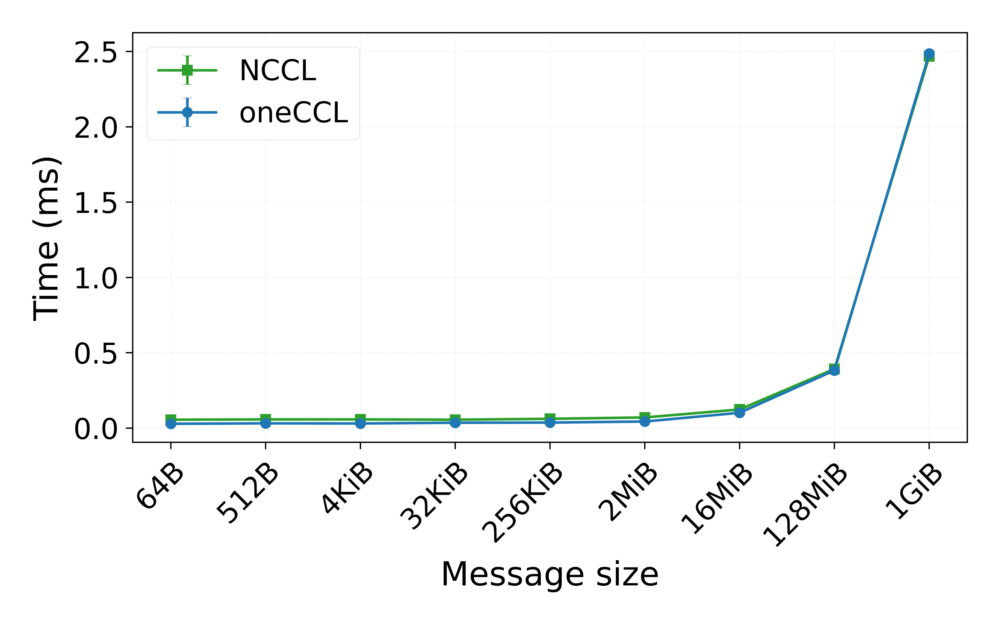
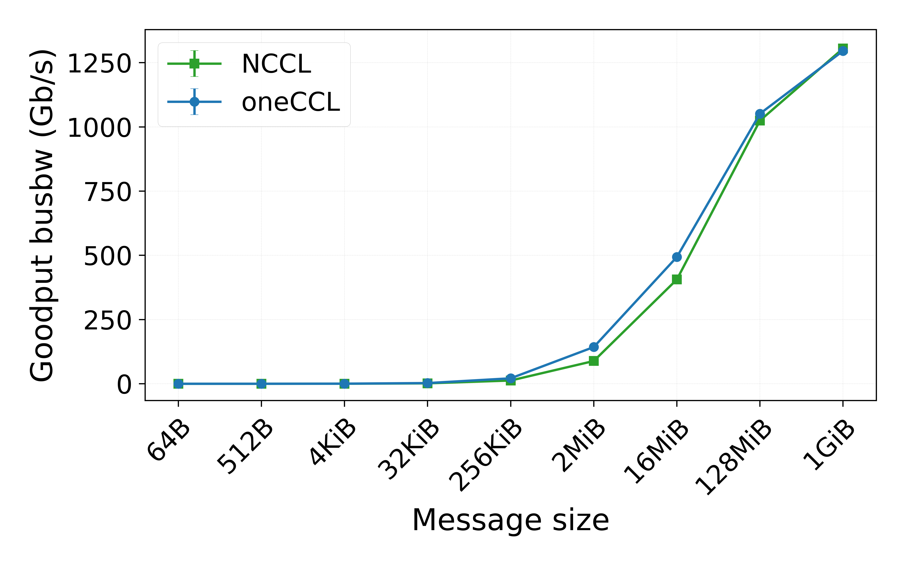
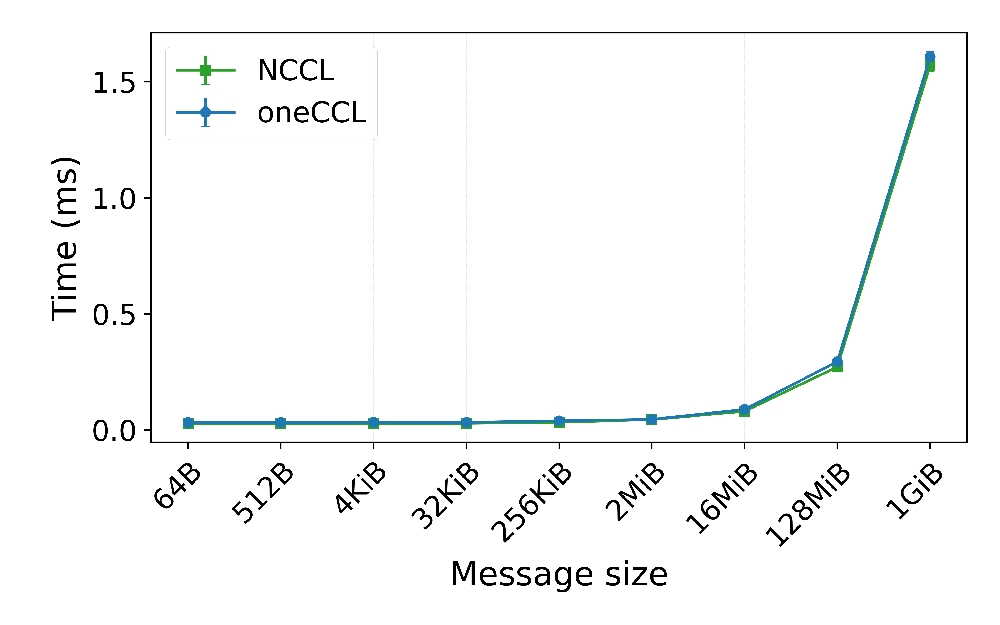
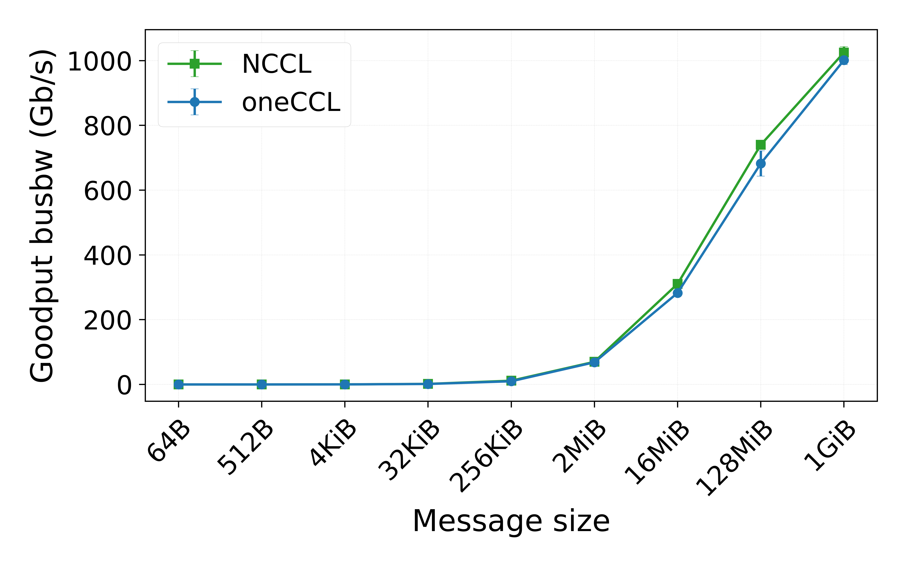

# Multi-GPU Collectives Benchmarks

Source-focused benchmarks for multi-GPU collective communication across NCCL, oneCCL, MPI, and RCCL. The repository is centered on the implementations under `src/` and the `Makefile` used to build them.

## Scope
- Collectives: `allreduce`, `alltoall`
- Startup benchmark: `init_time`
- Backends: `nccl`, `oneccl`, `mpi`, `rccl`
- Shared utilities: argument parsing and CSV logging in `src/common/include`

## Prerequisites

### NCCL
- NVIDIA GPU with recent drivers
- CUDA toolkit with `nvcc`
- NCCL headers and libraries
- MPI implementation
- NVIDIA Management Library (`libnvidia-ml`)

### oneCCL
- SYCL-capable compiler such as `icpx` or DPC++
- Intel oneCCL headers and libraries
- MPI implementation
- GPU runtime for the selected SYCL target

### MPI
- CUDA toolkit with `nvcc`
- MPI implementation

### RCCL
- ROCm with `hipcc`
- RCCL headers and libraries
- MPI implementation

## Build

The `Makefile` builds one binary per collective for each backend and also builds `init_time`.

```sh
# Build all NCCL binaries
make nccl

# Build a single NCCL collective
make nccl nccl_collective=allreduce

# Build oneCCL for the default target (nvidia)
make oneccl

# Build oneCCL for a specific target
make oneccl target=amd
make oneccl target=intel

# Build MPI or RCCL variants
make mpi
make rccl

# Clean build artifacts
make clean
```

Useful variables from the `Makefile`:

| Variable | Meaning |
|---|---|
| `NCCL_ROOT` | NCCL installation prefix |
| `NVCC` | CUDA compiler |
| `NVCC_ARCH` | CUDA architecture for NCCL and MPI builds |
| `ONECCL_INSTALL` | oneCCL installation prefix |
| `DPCPP_CLANGXX` | SYCL compiler |
| `DPCPP_LIB` | SYCL runtime library path |
| `target` | oneCCL backend target: `nvidia`, `amd`, `intel` |
| `HIPCC` | HIP compiler for RCCL |
| `ROCM_PATH` | ROCm installation prefix |

## Running

Each benchmark uses the same basic CLI:

- `--dtype`: `int`, `float`, or `double`
- `--count`: global element count
- `--output`: optional CSV output directory
- `--gpu_mode`: oneCCL only, `gpu` or `tile`

`allreduce` and `alltoall` interpret `--count` as a global count across all ranks. Output files are written as `{library}_{collective}_{dtype}_{count}_results.csv`.

Example NCCL run:

```sh
srun -N 1 -n 4 --gpus-per-node=4 \
  build/nccl/allreduce \
  --dtype float \
  --count 4194304 \
  --output ./out/nccl
```

Example oneCCL run:

```sh
mpirun -n 4 \
  build/oneccl/allreduce \
  --dtype float \
  --count 4194304 \
  --gpu_mode tile \
  --output ./out/oneccl
```

## Example results

The plots below show a 4-rank float comparison between NCCL and oneCCL on Leonardo.

### Allreduce

<p align="center">
  <a href="plots/leonardo/nccl_vs_oneccl_4rank/allreduce_float_time.pdf">
    
  </a>
  <a href="plots/leonardo/nccl_vs_oneccl_4rank/allreduce_float_goodput.pdf">
    
  </a>
</p>

### Alltoall

<p align="center">
  <a href="plots/leonardo/nccl_vs_oneccl_4rank/alltoall_float_time.pdf">
    
  </a>
  <a href="plots/leonardo/nccl_vs_oneccl_4rank/alltoall_float_goodput.pdf">
    
  </a>
</p>
